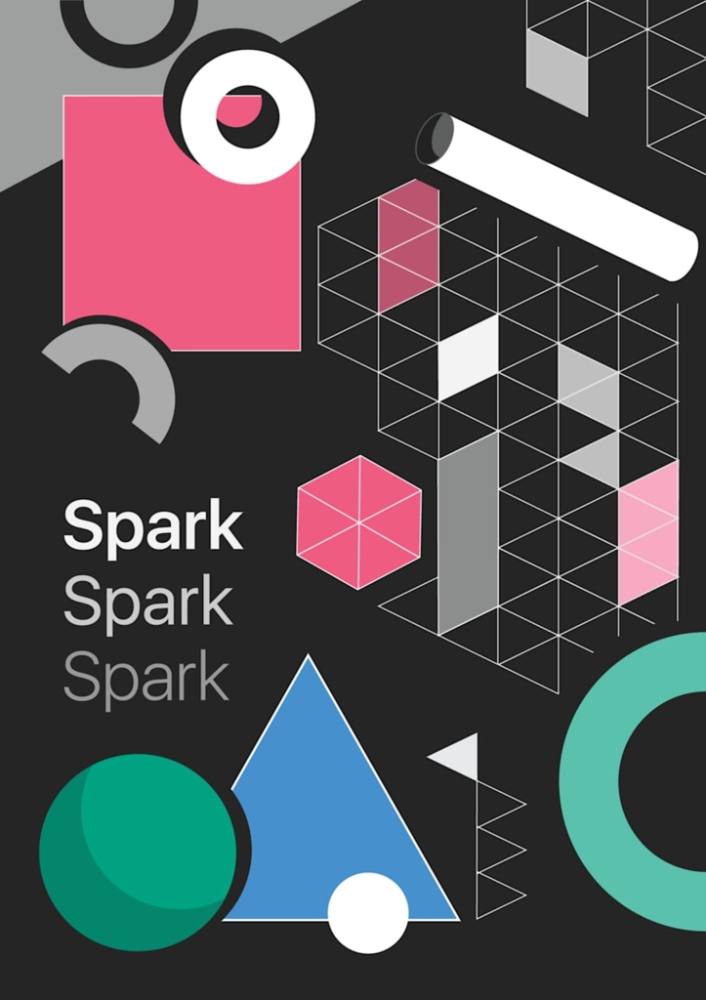

# xr-metaspark-flyingObject
First project that I ever made in Meta Spark 
A cereal box appears and opens up after targeting image target. A digital toy pops out of the box and you may increase its size (scale by pinch), and rotate (by screen pinch rotation).

- Used Meta Spark v178;
- assets from AR Library in Meta Spark (imported from sketchfab);
- Used cannon js to simulate gravity physics of the flying toy. 
- Tested on iOS 15

Target Image to trigger Cereal Box showing: 

